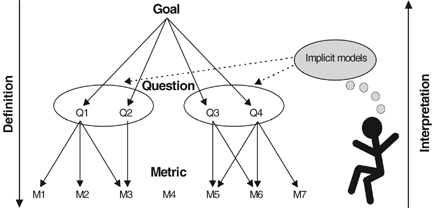

目标-问题-指标（GQM）是软件工程领域的一套系统方法，在研发效能度量实践中的作用和意义日益彰显。
通过系统化的数据度量和分析，我们可以更好地认知软件研发过程和产物，为研发团队提供及时反馈，优化研发流程，评价管理行为，提升研发效能，为开发者带来卓越的软件工程实践。
但目前产业界对 GQM 的应用存在两方面的误区：
一是简单从字面理解“目标”、“问题”和“指标”的概念，没有进一步理解它们的具体定义和背后的模型等精髓；
二是尚未充分意识到 GQM 是构建研发效能度量和改进体系的一种根本性方法。

今天我们可以看到很多关于研发效能度量的文章、演讲、案例和书籍。
它们虽然体现了实践中的第一手经验，但指标纷繁、模式各异，难免让人无所适从。
GQM 为我们提供了抓住本质、化繁为简的有效路径。

<!--truncate-->

## GQM 起源

GQM 最早由 Basili 提出[^Basili(1984)]，发表在软件工程领域权威期刊 IEEE Transactions on Software Engineering 上。
GQM 当初是为软件工程研究中的**数据收集和分析**而设计的，其**基本思想**是：
- 数据的收集和分析一定要聚焦于清晰具体的目标，每个目标划归为一组可量化回答的问题，每个问题通过若干特定的指标来回答。
- 依据指标收集到的数据，通过分析产生对问题的回答，进而达成定义的目标。

实际上，我们今天所讨论的研发效能度量，可以看作软件工程研究领域数据收集和分析的“低配版”。
软件工程研究通常需要生产环境中的数据来评价软件开发方法和认知软件开发过程，会采用 GQM 这样系统的方法，保证具体实施的科学性和严谨性。
实用目的下的研发效能度量，不必过度追求科学性和严谨性，但现实中往往因为一些随意乃至混乱的做法，获得无效的数据或误导的结论。
采用 GQM 方法，可以帮助我们实行真正有意义的研发效能度量。
我们先追本溯源，概览早期 GQM 的实施步骤。

### 早期步骤设计和参考意义 {#early-gqm}

> 效率是“以正确的方式做事”，而效能是“做正确的事”。
>
> ——彼得·德鲁克《有效的管理者》

GQM 包含如下六个基本步骤，其中最费时费力的一些步骤（标记了“*”）在今天已经因为流程工具的普及而变得非常便利。
正是因为这样数据收集成本的极大降低，让研发效能度量变得普遍可行和实用。
与此同时，其他 GQM 步骤侧重概念层面的思考和梳理，并不会给团队带来很大成本，却至关重要，能够保证整个过程在“做正确的事”。
它们在今天的研发效能度量实践中经常被忽视，得不偿失。

1. **确立数据收集的目标**。
目标通常分为两类，一类用于评价特定的软件开发方法，另一类独立于特定软件开发方法，用于认知软件研发过程或产出。
在研发效能度量实践中，评价改进措施的有效性即为前者，如 MARI 方法[^OpenMARI]中实施改进后的再次度量验证。
后者并不以评价为目的，而是对研发过程或产出在某些视角下进行刻画。
目标更完备的定义方法参见[经典模型](#classic-gqm)或[最新的实践](#modern-gqm)。

2. **列出感兴趣的问题**。
问题是主观设立的目标和量化度量之间的桥梁。
例如，对于“评价软件进行修改的难易程度”这个目标，问题可以包含“多少代码修改只限于单一模块”。
这些问题通常会决定最终数据的分类或参数。
例如，“代码修改在各个系统模块的分布如何”意味着代码提交的数据应按照系统模块进行分类。

3. **确立数据的分类**。
通常每个问题可以引出对数据的一种具体分类。
分类应不重不漏，作为下一步设计数据收集表格的依据。
在今天的研发效能度量实践中，这些分类可作为研发数据治理或数据规范的依据。

4. ***设计和测试数据收集表格**。
需要开发者在提交代码修改时手动填写数据收集表格。
这是早期时代的产物。
今天业界已经广泛使用研发流程工具（最具代表性的就是 Jira），大部分数据可以在流程运转过程中方便地存留或填入，如事物或缺陷的分类，不再需要单独的数据收集表格和额外步骤。
所以流程工具的普及和自然的信息存留，为研发效能向数据驱动的方向发展提供了现实基础。

5. ***收集和验证数据**。
数据表格如果发现问题，需要与填表人进行访谈，
这种安排在今天或许也可借鉴，比如事务填写预估的故事点，如果通过代码当量等进行校准时发现较大偏差，就值得在迭代回顾会上讨论偏差的原因，逐步提升团队预估故事点的准确性。

6. **分析数据**。
当时所说的数据分析局限在根据问题计算数据的参数和分布。
今天可以采用的分析方法更加多样，比如同比、环比对比，依赖比当时更多更丰富的可用数据。

## 理解经典 GQM {#classic-gqm}

GQM 方法提出后，经过了不断的丰富和发展，早期即应用在 NASA、惠普、普华永道、斯伦贝谢、西门子、爱立信、飞利浦、博世、戴姆勒-克莱斯勒、安联、宝洁等各行业先进企业，相关文献和引用比较丰富。
其中，Basili 在马里兰大学的技术报告[^Basili(1992)]和 2002 年与其他人合作的文章[^vanSolingen(2002)]是对经典 GQM 较为成熟和完整的阐述，推荐读者参考。
前者适合有研究背景的读者，但其表达和格式上存在一些不足之处，可能影响阅读和理解；后者适合行业中更广泛的读者，但其某些裁剪和简化容易误导实践，下面会逐一指出。
本文综合这两篇和其他文献的主要内容，将经典 GQM 的精华进行了提炼和总结。

### 整体框架

通过 GQM 雏形的主要[实操步骤](#early-gqm)，我们对该方法已经建立了初步的认知。图 1 展示了方法的整体框架。

图 1 - GQM 框架[^vanSolingen(2002)]

这里面需要特别提出的关键概念是**模型**。
问题本质上是一种定义模型的方法。
这个模型可以是显式的数学模型，也可以是通过问题反映出的在专家头脑中的隐式模型。
GQM 强调有效的研发效能度量必须：
- 以自上而下的方式定义，聚焦于特定目标；
- 应用于研发产物、过程和资源的全周期；
- 基于数据刻画，面向目标，自下而上进行解读。

### 概念层：目标

目标以通用术语表达组织的信息需要。其定义包括如下部分：
- **对象**：通常为研发的产物（如代码、文档、测试用例、制品等）、过程（如需求分析、设计、测试等）或资源（如人员、硬件等）。
- **目的**：刻画、了解、评价、预测、改进等。
- **视角**：成本、缺陷、及时性、准确性、可靠性、性能、用户满意度等。
- **视点**：用户、开发者、管理者、公司等。
- **环境**：度量的上下文，包括人员构成、研发模式、编程语言等，用于判断度量间的可比性。

文章[^vanSolingen(2002)]主张区分度量目标和改进目标。
度量为改进行动提供所需信息，即哪里需要改进和如何进行改进。
实际上，组织最终关心的是改进目标，度量目标为改进目标服务。
所以，我们更赞成将改进视作目标的一种目的[^Basili(1992)]，而改进目标到度量目标的转化可包含在问题和模型中。
从今天研发效能度量的角度看，我们认为改进恰恰应成为大部分目标的主要目的。

下面我们给出一个目标实例，其自然表述可以拆分出如上各个参数。

| 自然表述 | 项目经理关注的目标：改进代码修改请求处理的及时性 |
|---|---|
| 目的 | 改进 |
| 对象 | 代码修改请求处理的过程 |
| 视角 | 及时性 |
| 视点 | 项目经理 |

表 1 - 目标定义实例

我们注意到，环境这个参数在相关文献中较少展开论述，通常只是由目标项目或团队指代。
它在今天研发效能度量中的主要意义是支持度量间的比较，不论组织内部，还是同行对比，多用于以评价为目的的目标。
我们推荐在实践中简化目标定义，不必每一个目标都包含环境要素，而是只在需要度量间对比时进行定义。

### 操作层：问题

问题主要用于刻画目标[^vanSolingen(2002)]，隐含着在目标视角下刻画目标对象所采用的模型。
我们通过一个实例来具体理解“刻画”的含义和常见方式，见表 2。

| 目标 | 研发团队了解已交付产品的可靠性
| --- | --- |
| 问题 1 | 交付后发生的故障在时间上的分布是什么样的？ |
| 问题 2 | 交付后发生的故障在严重级别上的分布是什么样的？ |
| 问题 3 | 交付后发现的缺陷在模块上的分布是什么样的？ |
| 问题 4 | 模块重用性和可靠性之间的关系是什么样的？ |
| 问题 5 | 模块复杂度和可靠性之间的关系是什么样的？ |
| 问题 6 | 失效处理各阶段上的工作量的分布是什么样的？ |

表 2 - 问题列表实例

上面的问题列表并不一定是完备的，可以扩充或裁剪，取决于研发团队实际的信息需要。
这体现出 GQM 方法及其通过问题表达隐式模型的灵活性，从实际应用出发，根据实际情况判断。
通过这些问题，我们可以看到**分布**和**关系**是两种典型的刻画方式。
并且，它们都可以通过度量数据采用统计方法计算。

另一方面，这些问题隐含了对“可靠性”的定义。
我们未必显式描述该定义，但隐含的理解是，可靠性主要反映在已交付系统发生的失败和导致失败背后的软件缺陷上，所以问题才会围绕两者展开。
这种定义是隐式模型的重要组成部分。

全面来说，问题包含的几个主要方面如下[^Basili(1992)]：
- 目标对象的属性或行为的定义。
- 目标视角的定义。
- 目标视角下的改进。

### 量化层：指标

## 现代 GQM 实践指南 {#modern-gqm}

今天我们正在进入数据驱动研发效能的时代。
我们给出一份在今天应用 GQM 的最佳实践指南。
你需要知道的关于 GQM 的一切都在这里。

### 原理

- 在复杂的生产环境和软件开发过程中，利用<del>对照实验</del>进行**因果分析**或**评价具体实践措施**是不现实的，所以需要 GQM 方法建立模型，通过追问合理的问题和统计分析方法实现。
例如，通过回答“缺陷有哪些可判定的类型”、“各类型的缺陷数量如何分布”等问题找到导致缺陷的主要原因。
- GQM 的**核心思想**在于通过问题来建立和表达有关研发的模型，填补了显式（数学）模型难以定义的情况，在严谨性和实用性之间找到了合理的平衡。
可以说，GQM 的精髓是一种提问的艺术。

### 目标

- 我们将目标定义标准化为如下四个参数：
  - **目的**：了解（understanding）、评价（evaluation）和改进（improvement）中的一种。
  - **对象**：研发的过程（process）、产物（product）或资源（resource）。
  - **视角**：目标聚焦的角度或对象的属性。
  - **角色**：组织中谁会关注该目标，通常为开发者（developer）、项目经理（project manager）、技术经理（tech lead）、高层管理者（executive）中的一个或多个。

### 问题

- 问题是对模型的定义，该模型是对目标的拆解或刻画，以及将数据解读为目标的框架。
- 问题的设立会帮助我们根据数据分析来安排数据收集，而不是先收集数据才发现遗漏或者做了无用功。
例如，开发者需要给事务打哪些标签，应考虑后续数据分析要回答的问题来进行设计。
缺失标签会降低数据质量，多余或混乱的标签会浪费研发团队的时间。

### 指标

## 参考阅读

:::info
引用本文：任晶磊．GQM 从入门到精通．研发效能评论，2022-06-08．https://ls.meri.co/55bb4126.
:::

[^Basili(1984)]: V. R. Basili and D. M. Weiss, "[A Methodology for Collecting Valid Software Engineering Data](https://doi.org/10.1109/TSE.1984.5010301)," in _IEEE Transactions on Software Engineering_, vol. SE-10, no. 6, pp. 728-738, Nov. 1984.

[^Basili(1992)]: V. Basili, "[Software Modeling and Measurement: The Goal/Question/Metric Paradigm](https://hdl.handle.net/1903/7538)," University of Maryland, CS-TR-2956, UMIACS-TR-92-96, September 1992.

[^OpenMARI]: The OpenMARI project. https://www.openmari.dev.

[^vanSolingen(2002)]: van Solingen, R., (Revision), Basili, V., (Original article, 1994 ed.), Caldiera, G., (Original article, 1994 ed.) and Rombach, H.D., (Original article, 1994 ed.) (2002). Goal Question Metric (GQM) Approach. In Encyclopedia of Software Engineering, J.J. Marciniak (Ed.). https://doi.org/10.1002/0471028959.sof142